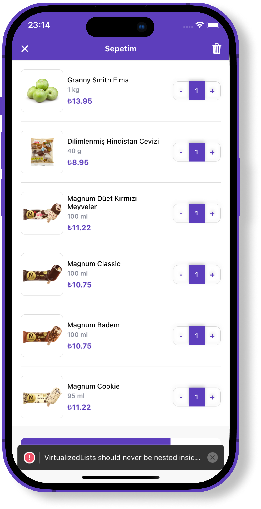

# React Native Getir Clone

## Table of Contents
- [Description](#description)
- [Installation](#installation)
- [Screenshots](#screenshots)
- [Features](#features)

## Description
This is a clone of the Getir app. It is built using React Native and Expo. It is a simple app that allows users to view products and add them to their cart. It also allows users to view their cart and remove items from it.

## Installation
1. Clone the repository
2. Run `npm install` to install the dependencies
3. Run `npm start` to start the app

## Screenshots

## Features

- [x] Homepage
- [x] Navigation
- [x] Product List
- [x] Product Details
- [x] Cart Page
- [ ] Redux Integration
- [ ] Add to Cart Functionality
- [ ] Remove from Cart Functionality
- [ ] Cart Total
- [ ] Cart Item Count